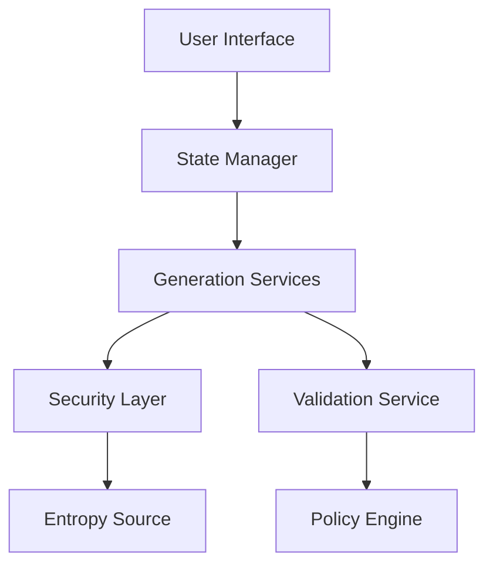

# Software Design Document
## Secret Password Generator 2.0

### 1. System Architecture Overview

The Secret Password Generator employs a layered architecture with clear separation of concerns. The system is designed to operate primarily client-side while maintaining enterprise-grade security and scalability.

#### 1.1 Core Architecture Components

```typescript
interface SystemArchitecture {
  presentationLayer: {
    userInterface: UIController;
    stateManagement: StateManager;
    notificationSystem: NotificationController;
  };
  
  businessLayer: {
    passwordService: PasswordGenerationService;
    pinService: PINGenerationService;
    secretService: SecretGenerationService;
    idService: IDGenerationService;
  };
  
  securityLayer: {
    entropyManager: EntropyService;
    cryptographicProvider: CryptoService;
    securityValidator: ValidationService;
  };
}
```

#### 1.2 Component Interaction Flow



### 2. Detailed Component Design

#### 2.1 Password Generation Service

```typescript
class PasswordGenerationService implements IPasswordGenerator {
  private readonly entropyService: EntropyService;
  private readonly policyEngine: PolicyEngine;
  private readonly patternManager: PatternManager;
  
  async generatePassword(config: PasswordConfig): Promise<Password> {
    const context = await this.analyzeContext(config.context);
    const policy = await this.policyEngine.getPolicy(context);
    const entropy = await this.entropyService.getSecureEntropy(config.length);
    
    return this.transformToPassword(entropy, config, policy);
  }
  
  private async analyzeContext(context: GenerationContext): Promise<SecurityContext> {
    // Context analysis implementation
  }
}
```

#### 2.2 PIN Generation Service

```typescript
class PINGenerationService implements IPINGenerator {
  private readonly industryStandards: IndustryStandardProvider;
  private readonly securityAnalyzer: SecurityAnalyzer;
  
  async generatePIN(config: PINConfig): Promise<PIN> {
    const standard = await this.industryStandards.getStandard(config.industry);
    const requirements = await this.analyzeRequirements(standard);
    
    return this.generateSecurePIN(requirements);
  }
}
```

#### 2.3 Secret Generation Service

```typescript
class SecretGenerationService implements ISecretGenerator {
  private readonly algorithmProvider: AlgorithmProvider;
  private readonly keyManager: KeyManager;
  
  async generateSecret(config: SecretConfig): Promise<Secret> {
    const algorithm = this.algorithmProvider.getAlgorithm(config.type);
    const params = await this.prepareParameters(config);
    
    return algorithm.generateSecret(params);
  }
}
```

### 3. Security Implementation

#### 3.1 Entropy Management

```typescript
class EntropyService implements IEntropyProvider {
  private readonly hardwareRNG: HardwareRandomSource;
  private readonly entropyPool: EntropyPool;
  
  async getSecureEntropy(bytes: number): Promise<Buffer> {
    await this.ensureEntropyQuality();
    return this.entropyPool.getRandomBytes(bytes);
  }
  
  private async ensureEntropyQuality(): Promise<void> {
    const quality = await this.measureEntropyQuality();
    if (quality < MINIMUM_ENTROPY_QUALITY) {
      await this.replenishEntropy();
    }
  }
}
```

#### 3.2 Cryptographic Operations

```typescript
class CryptographicService implements ICryptoProvider {
  private readonly algorithmFactory: AlgorithmFactory;
  
  async encrypt(data: Buffer, config: CryptoConfig): Promise<EncryptedData> {
    const algorithm = this.algorithmFactory.create(config.algorithm);
    return algorithm.encrypt(data, config.params);
  }
}
```

### 4. State Management

#### 4.1 Application State

```typescript
interface ApplicationState {
  generatorConfig: GeneratorConfiguration;
  generationHistory: GenerationHistory;
  userPreferences: UserPreferences;
  securityStatus: SecurityStatus;
}

class StateManager implements IStateManager {
  private store: Store<ApplicationState>;
  
  async updateConfig(config: Partial<GeneratorConfiguration>): Promise<void> {
    await this.validateConfig(config);
    this.store.dispatch(updateConfigAction(config));
  }
}
```

#### 4.2 History Management

```typescript
class HistoryManager implements IHistoryManager {
  private readonly storage: SecureStorage;
  
  async addToHistory(item: GeneratedItem): Promise<void> {
    await this.sanitizeItem(item);
    await this.storage.secureStore(item);
  }
}
```

### 5. User Interface Components

#### 5.1 Generator Interface

```typescript
interface GeneratorProps {
  config: GeneratorConfig;
  onGenerate: (result: GenerationResult) => void;
  onError: (error: GenerationError) => void;
}

class GeneratorComponent extends React.Component<GeneratorProps> {
  private readonly generator: IGenerator;
  
  async handleGenerate(): Promise<void> {
    try {
      const result = await this.generator.generate(this.props.config);
      this.props.onGenerate(result);
    } catch (error) {
      this.props.onError(error);
    }
  }
}
```

#### 5.2 Configuration Interface

```typescript
interface ConfigurationProps {
  current: GeneratorConfig;
  onChange: (config: GeneratorConfig) => void;
}

class ConfigurationComponent extends React.Component<ConfigurationProps> {
  private readonly validator: ConfigValidator;
  
  async handleConfigChange(updates: Partial<GeneratorConfig>): Promise<void> {
    const validated = await this.validator.validate(updates);
    this.props.onChange(validated);
  }
}
```

### 6. Integration Points

#### 6.1 External API

```typescript
class APIController implements IAPIController {
  private readonly authService: AuthenticationService;
  private readonly generators: GeneratorServices;
  
  async handleGenerationRequest(req: APIRequest): Promise<APIResponse> {
    await this.authService.validateRequest(req);
    const result = await this.generators.generate(req.params);
    return this.formatResponse(result);
  }
}
```

#### 6.2 Enterprise Integration

```typescript
class EnterpriseIntegration implements IEnterpriseIntegrator {
  private readonly directoryService: DirectoryService;
  private readonly policyService: PolicyService;
  
  async validateEnterpriseUser(user: User): Promise<ValidationResult> {
    const directory = await this.directoryService.authenticate(user);
    return this.policyService.validateAccess(user, directory);
  }
}
```

### 7. Testing Strategy

#### 7.1 Unit Testing

```typescript
describe('PasswordGenerator', () => {
  let generator: PasswordGenerator;
  
  beforeEach(() => {
    generator = new PasswordGenerator(mockEntropy, mockPolicy);
  });
  
  it('should generate valid passwords', async () => {
    const password = await generator.generate(testConfig);
    expect(password).toMatchPolicy(testConfig.policy);
  });
});
```

#### 7.2 Integration Testing

```typescript
describe('EnterpriseIntegration', () => {
  let integration: EnterpriseIntegration;
  
  beforeEach(() => {
    integration = new EnterpriseIntegration(mockServices);
  });
  
  it('should validate enterprise users', async () => {
    const result = await integration.validateUser(testUser);
    expect(result.isValid).toBe(true);
  });
});
```