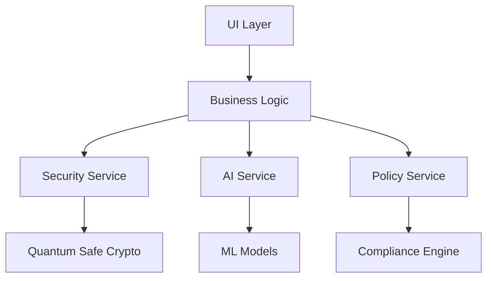

# Software Design Document
## Secret Password Generator 2.0 (Final Version)

### 1. System Architecture

#### 1.1 High-Level Architecture

The system follows a layered architecture pattern with quantum-safe security and AI integration:

```typescript
interface SystemArchitecture {
  presentationLayer: React.ComponentType;
  businessLogicLayer: BusinessLogicService;
  securityLayer: SecurityService;
  aiLayer: AIService;
  dataLayer: DataService;
}

class SecurePasswordSystem implements SystemArchitecture {
  constructor(
    private readonly config: SystemConfig,
    private readonly securityProvider: SecurityProvider,
    private readonly aiProvider: AIProvider
  ) {}
}
```

#### 1.2 Component Interaction



### 2. Detailed Component Design

#### 2.1 Security Components

```typescript
interface QuantumSafeGenerator {
  generatePassword(config: GeneratorConfig): Promise<SecurePassword>;
  validateStrength(password: Password): SecurityScore;
  ensureQuantumSafety(password: Password): QuantumResistance;
}

class QuantumSafePasswordGenerator implements QuantumSafeGenerator {
  private readonly entropyService: EntropyService;
  private readonly quantumProvider: QuantumProvider;
  
  async generatePassword(config: GeneratorConfig): Promise<SecurePassword> {
    const entropy = await this.getQuantumSafeEntropy(config.length);
    return this.transformToPassword(entropy, config);
  }
}

interface EntropyService {
  getQuantumSafeEntropy(bytes: number): Promise<Uint8Array>;
  validateEntropyQuality(entropy: Uint8Array): QualityScore;
  maintainEntropyPool(): void;
}
```

#### 2.2 AI Components

```typescript
interface AIService {
  analyzeContext(context: UseContext): Promise<SecurityRequirements>;
  generateSuggestions(requirements: SecurityRequirements): Suggestions;
  learnFromFeedback(feedback: UserFeedback): Promise<void>;
}

class SecureAIService implements AIService {
  private readonly modelManager: ModelManager;
  private readonly federated: FederatedLearner;
  
  async analyzeContext(context: UseContext): Promise<SecurityRequirements> {
    const embedding = await this.modelManager.embed(context);
    return this.mapToRequirements(embedding);
  }
}
```

### 3. Data Flow Architecture

#### 3.1 Password Generation Flow

```typescript
interface PasswordGenerationFlow {
  step1_collectRequirements(): Promise<Requirements>;
  step2_validatePolicy(): Promise<PolicyValidation>;
  step3_generateCandidate(): Promise<Password>;
  step4_validateStrength(): Promise<ValidationResult>;
  step5_deliver(): Promise<DeliveryResult>;
}

class SecureGenerationFlow implements PasswordGenerationFlow {
  private readonly securityService: SecurityService;
  private readonly policyEngine: PolicyEngine;
  
  async generateSecurePassword(): Promise<Password> {
    const requirements = await this.collectRequirements();
    await this.validateAgainstPolicy(requirements);
    return this.generateAndValidate(requirements);
  }
}
```

#### 3.2 Enterprise Integration Flow

```typescript
interface EnterpriseFlow {
  validateCredentials(credentials: Credentials): Promise<AuthResult>;
  enforcePolicy(policy: SecurityPolicy): Promise<PolicyResult>;
  logAuditEvent(event: AuditEvent): Promise<void>;
  generateReport(criteria: ReportCriteria): Promise<Report>;
}
```

### 4. Security Implementation

#### 4.1 Quantum-Safe Implementation

```typescript
class QuantumSafeImplementation {
  private readonly pqcProvider: PQCProvider;
  private readonly hybridCrypto: HybridCryptoService;
  
  async generateQuantumSafeKey(): Promise<QuantumSafeKey> {
    const classicalKey = await this.generateClassicalKey();
    const quantumKey = await this.generatePQCKey();
    return this.hybridCrypto.combine(classicalKey, quantumKey);
  }
}
```

#### 4.2 Zero-Knowledge Operations

```typescript
interface ZeroKnowledgeOperations {
  proveOperation(operation: Operation): Promise<Proof>;
  verifyProof(proof: Proof): Promise<boolean>;
  maintainPrivacy(data: SensitiveData): Promise<void>;
}
```

### 5. AI/ML Implementation

#### 5.1 Model Management

```typescript
interface ModelManager {
  loadModel(type: ModelType): Promise<Model>;
  updateModel(update: ModelUpdate): Promise<void>;
  validateModel(model: Model): ValidationResult;
  monitorPerformance(metrics: Metrics): void;
}
```

#### 5.2 Federated Learning

```typescript
interface FederatedLearning {
  trainLocally(data: TrainingData): Promise<ModelUpdate>;
  aggregateUpdates(updates: ModelUpdate[]): Promise<ModelUpdate>;
  applyUpdate(update: ModelUpdate): Promise<void>;
}
```

### 6. User Interface Implementation

#### 6.1 Component Architecture

```typescript
interface UIComponents {
  PasswordGenerator: React.FC<GeneratorProps>;
  SecurityDashboard: React.FC<DashboardProps>;
  PolicyManager: React.FC<PolicyProps>;
  EnterpriseControls: React.FC<EnterpriseProps>;
}
```

#### 6.2 State Management

```typescript
interface AppState {
  passwordConfig: PasswordConfig;
  securityStatus: SecurityStatus;
  userPreferences: UserPreferences;
  enterprisePolicy: EnterprisePolicy;
}
```

### 7. Testing Strategy

#### 7.1 Unit Testing

```typescript
describe('QuantumSafeGenerator', () => {
  it('should generate quantum-safe passwords', async () => {
    const generator = new QuantumSafeGenerator();
    const password = await generator.generate(config);
    expect(await generator.validateQuantumSafety(password)).toBe(true);
  });
});
```

#### 7.2 Integration Testing

```typescript
describe('EnterpriseIntegration', () => {
  it('should enforce enterprise policies', async () => {
    const integration = new EnterpriseIntegration();
    const result = await integration.enforcePolicy(testPolicy);
    expect(result.compliance).toBe(true);
  });
});
```

### 8. Deployment Architecture

#### 8.1 Edge Deployment

```typescript
interface EdgeDeployment {
  deployToEdge(package: DeploymentPackage): Promise<DeploymentResult>;
  monitorEdgePerformance(metrics: EdgeMetrics): void;
  updateEdgeComponents(updates: EdgeUpdates): Promise<void>;
}
```

#### 8.2 Enterprise Deployment

```typescript
interface EnterpriseDeployment {
  deployToEnterprise(config: EnterpriseConfig): Promise<DeploymentResult>;
  configureSecurity(security: SecurityConfig): Promise<void>;
  setupCompliance(compliance: ComplianceConfig): Promise<void>;
}
```

### 9. Monitoring and Maintenance

#### 9.1 Performance Monitoring

```typescript
interface PerformanceMonitor {
  trackMetrics(metrics: SystemMetrics): void;
  alertOnThreshold(threshold: Threshold): void;
  generateReport(criteria: ReportCriteria): Report;
}
```

#### 9.2 Security Monitoring

```typescript
interface SecurityMonitor {
  monitorThreats(threats: ThreatFeed): void;
  trackVulnerabilities(vuln: Vulnerability): void;
  enforceCompliance(rules: ComplianceRules): void;
}
```